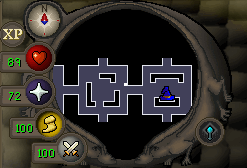
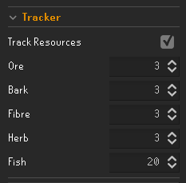

# Gauntlet Minimap v1.2  

## Description

A plugin for The Gauntlet to see the resource nodes and demi-bosses on your minimap.

The plugin supports both the normal and the corrupted Gauntlet.

## Features

- An icon of the resource node on your minimap.

- An icon of the demi-boss on your minimap.

- The ability to hide/display certain resource nodes and demi-bosses.

- The ability to track gathered resources and hide them from the minimap when a certain amount is reached.

